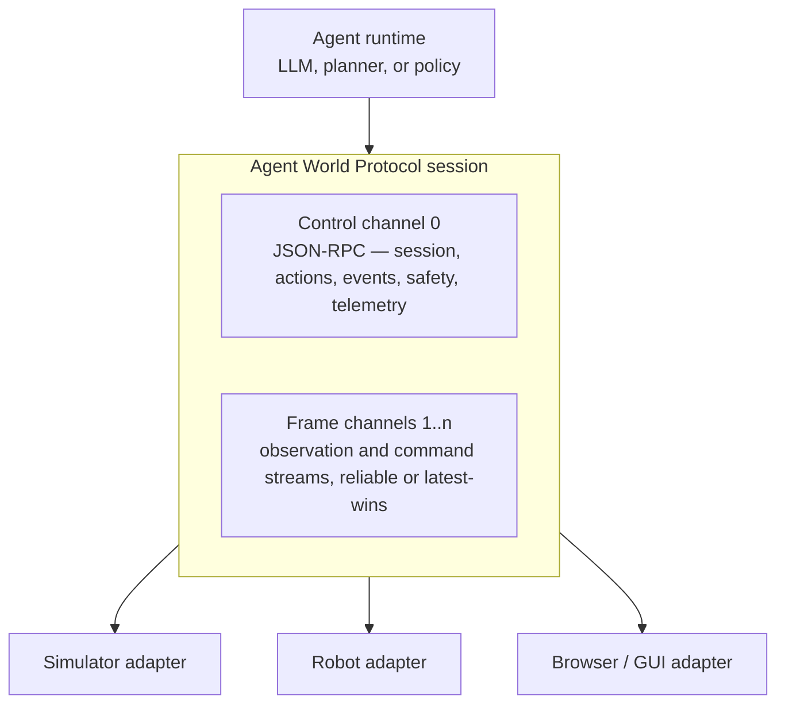

AWP is defined in four layers over a single channel model. The layers organize the specification; they are not versioned separately. A single negotiated protocol version covers all four (see [versioning policy](/spec/versioning-policy), AWP-VER-001 and AWP-VER-006).

## Layers

| Layer | Name | Defines |
|---|---|---|
| 0 | [Transport](/spec/transport/overview) | The channel model, control-channel framing (JSON-RPC 2.0), the binary frame envelope, and bindings |
| 1 | [Session & capabilities](/spec/session/lifecycle) | Manifest exchange, negotiation, embodiment binding |
| 2 | [Perception & action](/spec/loop/time-models) | Time models, observation frames, the action lifecycle |
| 3 | [Semantics & grounding](/spec/semantics/units-and-frames) | Units, frames, clocks, modality encodings, scene graphs |

## One channel model

Everything a session transmits belongs to a channel. Channel 0 is the **control channel**: JSON-RPC messages that are reliable, ordered, replayed after a reconnection, and logged in full — handshakes, action submissions and statuses, world events, approvals, heartbeats, telemetry. Channels 1 and up are **frame channels**: observation streams from the world and command streams from the agent, each declared with a modality and a class, `reliable` or `latest-wins`, and logged by hash. Ordering holds within a channel and never across channels, so the protocol states the few cross-channel relations it needs explicitly.

A binding maps channels onto connections. The control channel always has its own connection; frame channels ride inline on it, or on stream connections such as WebTransport, WebRTC, or shared memory that give each channel its own flow control, so that a burst of camera frames can never delay an e-stop event.

Cross-cutting the layers are the [safety model](/concepts/safety-model), [reproducibility](/spec/reproducibility), and [conformance profiles](/spec/profiles/core).
