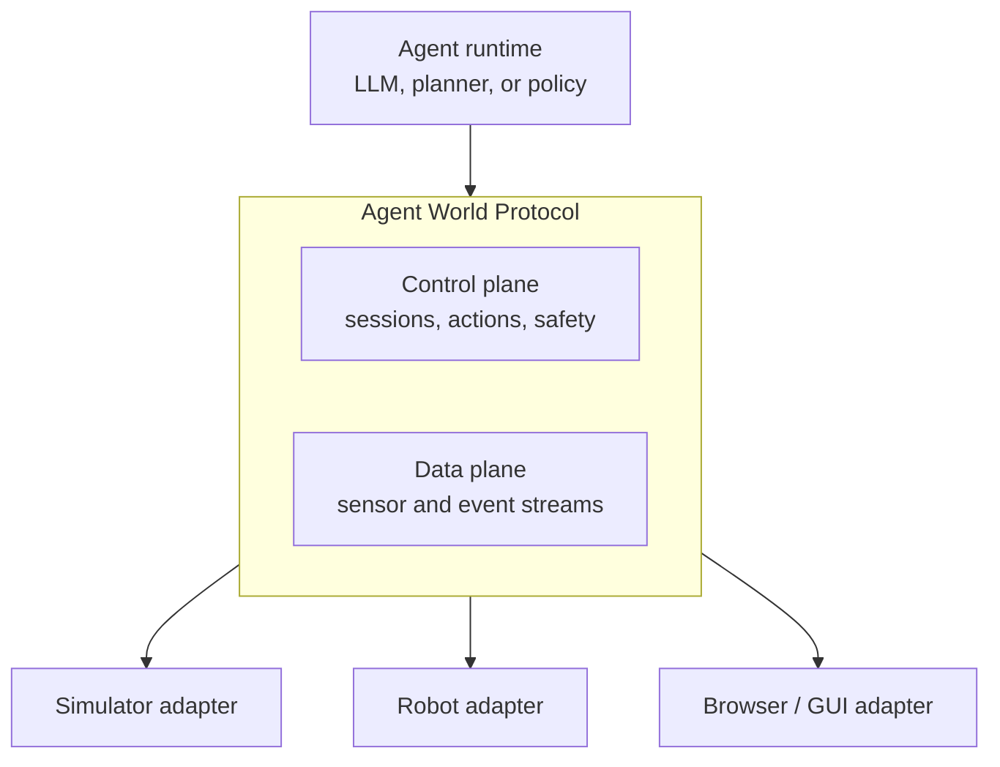

AWP is defined in four layers over two planes. The layers organize the specification; they are not versioned separately. A single negotiated protocol version covers all four (see [versioning policy](/spec/versioning-policy), AWP-VER-001 and AWP-VER-006).

## Layers

| Layer | Name | Defines |
|---|---|---|
| 0 | [Transport](/spec/transport/overview) | Control-plane framing (JSON-RPC 2.0) and data-plane binary streams |
| 1 | [Session & capabilities](/spec/session/lifecycle) | Manifest exchange, negotiation, embodiment binding |
| 2 | [Perception & action](/spec/loop/time-models) | Time models, observation frames, the action lifecycle |
| 3 | [Semantics & grounding](/spec/semantics/units-and-frames) | Units, frames, clocks, modality encodings, scene graphs |

## The two planes

The **control plane** carries low-bandwidth, reliability-critical messages: handshakes, action submissions, lifecycle events, safety approvals. The **data plane** carries high-bandwidth, loss-tolerant streams in both directions: sensor channels (camera frames, audio, lidar) world→agent, and high-rate command channels agent→world. The control plane negotiates data-plane endpoints; the spec defines the framing, not the pipe.

Cross-cutting the layers are the [safety model](/concepts/safety-model), [reproducibility](/spec/reproducibility), and [conformance profiles](/spec/profiles/core).
