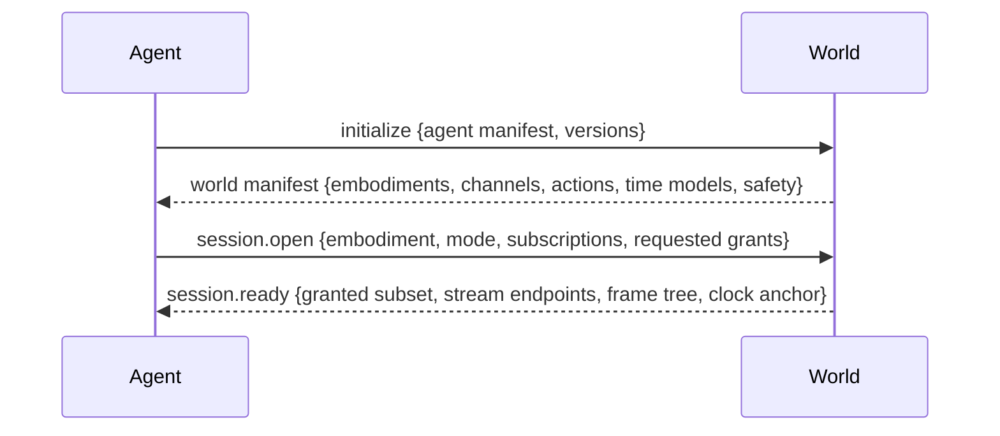

A session is the negotiated contract binding an agent to an embodiment in a world.

The **world manifest** is what makes AWP worlds self-describing: a generic agent discovers at runtime what bodies exist, what it can perceive, and what it can do — the same way an MCP client discovers tools. The **agent manifest** declares supported modalities and protocol versions so the world can tailor or reject.

Negotiation always resolves to a subset: the world MAY grant fewer channels, action types, or looser rates than requested, and MUST say exactly what was granted in `session.ready`. Renegotiation mid-session uses the same messages. Normative rules: [session lifecycle](/spec/session/lifecycle) and [negotiation](/spec/session/negotiation).
