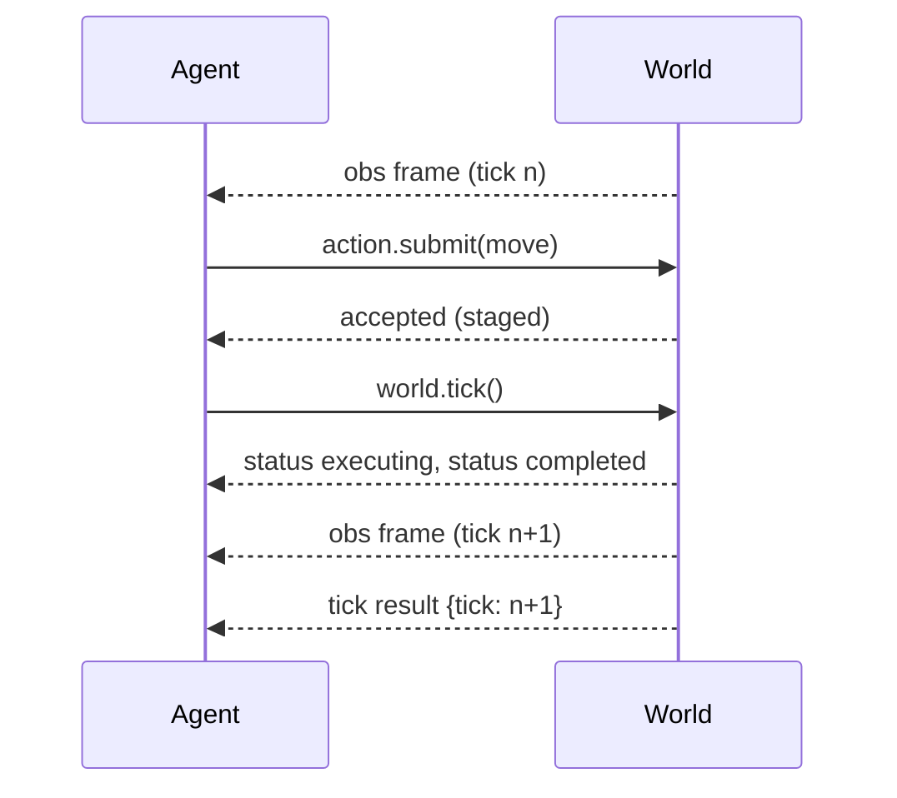
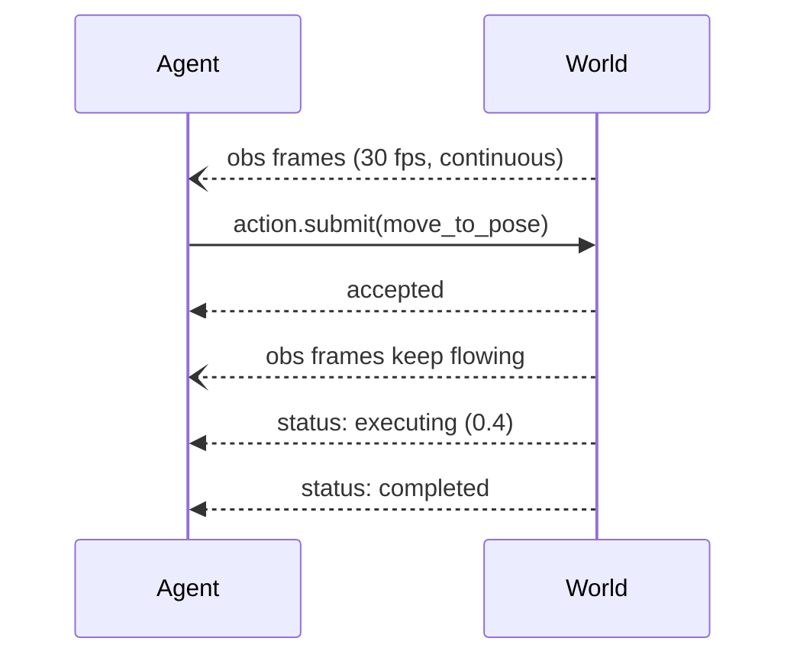

A simulator can pause and wait for the agent. Reality cannot. AWP therefore defines two time models; a world declares which it supports, and a session runs in exactly one.

## Lockstep

The world advances only when the agent calls `world.tick`. Submitting an action stages it; the next tick executes it and delivers the resulting observation. Perfect for turn-based games, deterministic simulation, and evaluation harnesses.

An agent that submits and then waits for completion without ticking waits forever: nothing advances until it asks. Normative sequence and a full wire trace: [spec/loop/time-models](/spec/loop/time-models#wire-trace).

## Streaming

The world runs in wall-clock time. Observations are pushed with timestamps; actions are asynchronous intents that report progress while the world keeps moving. Robots only offer streaming; most simulators offer both.

## Why this is the crux

<Warning>
An agent written only for lockstep will silently misbehave in streaming mode: its observations are stale by the time it acts. Streaming worlds MUST report observation→action latency so agents can compensate, and agents SHOULD treat every observation as a snapshot of the past.
</Warning>

Because both modes share identical manifests, schemas, and action lifecycles, the same agent code can train in lockstep against a simulator adapter and deploy in streaming against hardware — swapping only the session mode. That is the [sim-to-real](/guides/sim-to-real) story. Normative details: [spec/loop/time-models](/spec/loop/time-models).
