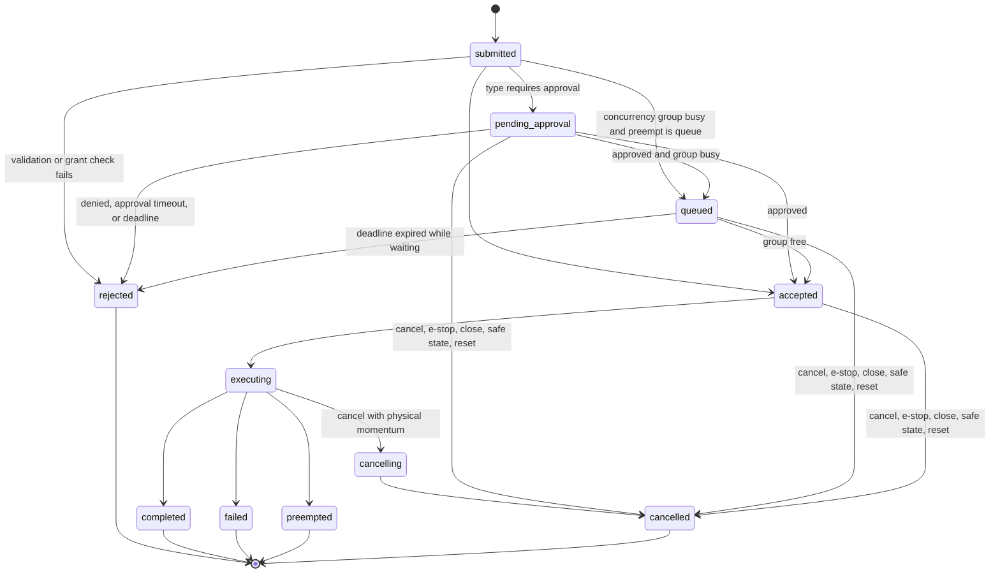

An action passes through three distinct gates that earlier drafts conflated: **admission** (the world has received and validated the intent and tells the agent where it stands), **permission** (the world has decided the action may execute), and **execution**. Approval and queueing sit between admission and permission; they are states, not delays on the admission acknowledgement.

## States

| State | Class | Meaning |
|---|---|---|
| `submitted` | transient | The world has received the intent. Never reported on the wire; exists to name the validation step. |
| `pending_approval` | pre-execution | Validation passed; the type requires approval ([approval](/spec/safety/approval)) and no decision has arrived. |
| `queued` | pre-execution | Validation (and approval, if any) passed; another action in the same concurrency group is executing and the submission chose `preempt: "queue"`. |
| `accepted` | pre-execution | Permission to execute has been granted. The world will begin execution at the next opportunity (immediately in streaming; at the next advance in lockstep). |
| `executing` | execution | The action is affecting the world. Progress updates are sent in this state. |
| `cancelling` | execution | An `action.cancel`, session close, or world reset arrived while executing and the world is completing its safe abort before reporting `cancelled`. |
| `rejected` | terminal | The action never executed and had no side effects. |
| `completed` | terminal | Executed to its declared goal. |
| `failed` | terminal | Execution began and ended without reaching the goal. |
| `preempted` | terminal | Execution ended because a newer submission in the same concurrency group replaced or blended it ([preemption](/spec/loop/preemption)). |
| `cancelled` | terminal | Ended by `action.cancel`, e-stop, session close, safe-state entry, or world reset. If cancellation happened before `executing`, the action had no side effects. |

**Invariant.** `rejected` and any `cancelled` reached from a pre-execution state guarantee no side effects. `failed`, `preempted`, and `cancelled` reached through `cancelling` may leave partial effects, reported via `aborted_at_progress`.

## Requirements

- The world MUST send an `action.status` notification on every transition after admission. Terminal states are `rejected`, `completed`, `failed`, `preempted`, `cancelled`. Every action reaches exactly one logical terminal state. `[AWP-LIF-001]`
- **Admission acknowledgement.** The `action.submit` result MUST report the post-validation state — `pending_approval`, `queued`, or `accepted` — or return a JSON-RPC error, in which case the action is `rejected`. In streaming mode the result MUST arrive within 500 ms of receipt; in lockstep, before the result of the advance in which the submission was received. Waiting for approval or for a queue slot does not count against this bound. `[AWP-LIF-002]`
- During `executing`, worlds SHOULD send progress updates (`progress` ∈ [0,1]) for `duration: extended` types at ≥1 Hz in streaming mode and at least once per tick in lockstep. `[AWP-LIF-003]`
- `failed`, `rejected`, and `cancelled` statuses MUST carry a machine-readable `reason` from the [status reason registry](/spec/loop/events-and-errors#status-reasons) and MAY carry human-readable `detail`. `[AWP-LIF-004]`
- **Cancellation.** `action.cancel` on a pre-execution action transitions it directly to `cancelled` (reason `cancelled_by_agent`). On an `executing` action the world MUST enter `cancelling`, complete its safe abort, then report `cancelled` with `aborted_at_progress`. `cancelling` is reported as a status like any other state. `[AWP-LIF-005]`
- **Replay.** Undelivered `action.status` notifications MUST be replayed on `session.resume` according to the [delivery contract](/spec/transport/control-plane#status-delivery-and-replay). `[AWP-LIF-006]`
- **Streaming duration.** `duration: streaming` actions ([command channels](/spec/loop/command-channels)) have no self-completion: they remain `executing` while their stream is live and terminate only via `cancelling → cancelled`, `failed` (reason `watchdog`, `envelope`, `deadline_exceeded`, `e_stop`, `connection_lost`), or `preempted` (AWP-CMD-004). `[AWP-LIF-007]`
- **Precedence.** When several terminating causes coincide, the world MUST apply the first that applies in this order: e-stop → safe-state entry → `action.cancel` → deadline expiry → approval decision → preemption by a newer submission. The `reason` reported is the cause that won. `[AWP-LIF-008]`
- **Transition vs delivery.** A transition happens once, in the world, at a single `ts_mono_ns`. Its `action.status` notification MAY be delivered more than once (after reconnection, AWP-CTL-008). Receivers MUST deduplicate on `(action_id, status_seq)` and MUST NOT treat a redelivered terminal status as a second terminal transition. `[AWP-LIF-009]`

## Deadline origin

`deadline_ms` is measured from the world's receipt of `action.submit` (the `ts_mono_ns` it records for the `submitted` step) and spans approval waiting, queue waiting, and execution. Expiry in a pre-execution state → `rejected`, reason `deadline_exceeded` (no side effects). Expiry during `executing` → `failed`, reason `deadline_exceeded`, after the type's safe-abort behavior (AWP-ACT-004). In lockstep, deadlines are advisory and MAY be ignored.

## Terminal rules for pre-execution actions

| Cause | `pending_approval` / `queued` / `accepted` | `executing` |
|---|---|---|
| `action.cancel` | `cancelled`, `cancelled_by_agent` | `cancelling` → `cancelled` |
| Approval denied / timed out | `rejected`, `approval_denied` / `approval_timeout` | — |
| Deadline expiry | `rejected`, `deadline_exceeded` | `failed`, `deadline_exceeded` |
| `e_stop_engaged` (AWP-EVT-002) | `cancelled`, `e_stop` | `failed`, `e_stop` (safe abort is implicit in the e-stop) |
| Safe-state entry (AWP-SAF-003) | `cancelled`, `safe_state` | `failed`, `connection_lost` (safe abort is the safe-state behavior) |
| `session.close` / window expiry (AWP-SES-006) | `cancelled`, `session_closed` | `cancelling` → `cancelled`, `session_closed` |
| `world.reset` / `world.restore` (AWP-PRM-006) | `cancelled`, `world_reset` | `cancelling` → `cancelled`, `world_reset` |
| Newer `replace`/`blend` submission in group | `cancelled`, `superseded` | `preempted` |

Queued actions leave the queue in submission order when the group frees; each is re-checked against grants and envelopes at the moment it becomes `accepted`, and MAY be `rejected` then.
