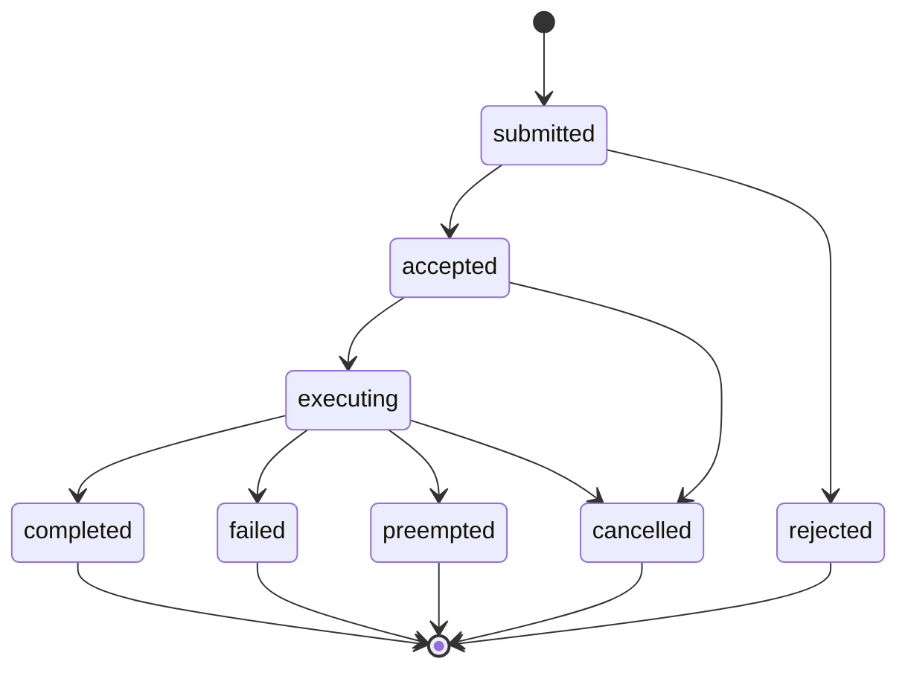

- The world MUST send `action.status` notifications on every transition; terminal states are `rejected`, `completed`, `failed`, `preempted`, `cancelled`. Exactly one terminal status per action. `[AWP-LIF-001]`
- `accepted` MUST be sent (or `rejected`) within 500 ms in streaming mode; in lockstep, within the same tick. `[AWP-LIF-002]`
- During `executing`, worlds SHOULD send progress updates (`progress` ∈ [0,1]) for `duration: extended` types at ≥1 Hz in streaming mode. `[AWP-LIF-003]`
- `failed` and `rejected` statuses MUST carry a machine-readable `reason` from the [error taxonomy](/spec/loop/events-and-errors) and MAY carry human-readable detail. `[AWP-LIF-004]`
- `action.cancel` requests transition to `cancelled`; if execution has physical momentum, the world completes its safe-abort first, then reports `cancelled` with `aborted_at_progress`. `[AWP-LIF-005]`
- Status notifications survive reconnection: on `session.resume` the world MUST replay any undelivered terminal statuses. `[AWP-LIF-006]`
