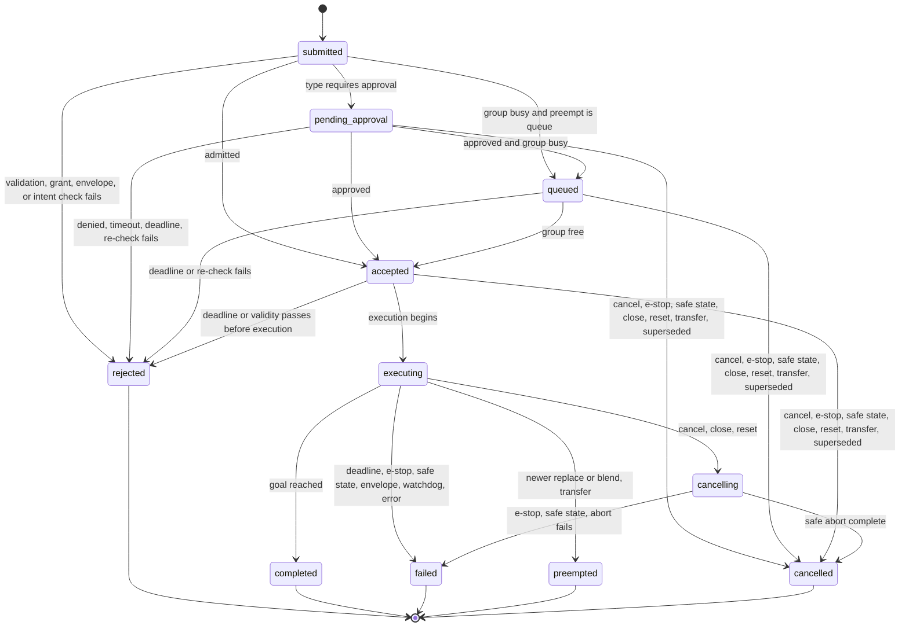

An action passes through three distinct gates: **admission** (the world has received and validated the intent and tells the agent where it stands), **permission** (the world has decided the action may execute), and **execution**. Approval and queueing sit between admission and permission; they are states, not delays on the admission acknowledgement.

The diagram is drawn from the normative transition table [`spec/action-lifecycle.yaml`](https://github.com/Hyperduality/agent-world-protocol/blob/main/spec/action-lifecycle.yaml), which also lists the reasons each transition may carry; CI fails if the two disagree and checks every [wire trace](/spec/wire-traces) against the table.

## States

| State | Class | Meaning |
|---|---|---|
| `submitted` | transient | The world has received the intent. Never reported on the wire; exists to name the validation step. |
| `pending_approval` | pre-execution | Validation passed; the type requires approval ([approval](/spec/safety/approval)) and no decision has arrived. |
| `queued` | pre-execution | Validation (and approval, if any) passed; another action in the same concurrency group is executing and the submission chose `preempt: "queue"`. |
| `accepted` | pre-execution | Permission to execute has been granted. The world will begin execution at the next opportunity (immediately in streaming; at the next advance in lockstep). |
| `executing` | execution | The action is affecting the world. Progress updates are sent in this state. |
| `cancelling` | execution | An `action.cancel`, session close, or world reset arrived while executing and the world is completing its safe abort. Ends `cancelled`, or `failed` if an e-stop or safe-state entry intervenes or the abort cannot complete. |
| `rejected` | terminal | The action never executed and had no side effects. |
| `completed` | terminal | Executed to its declared goal. |
| `failed` | terminal | Execution began and ended without reaching the goal. |
| `preempted` | terminal | Execution ended because a newer submission in the same concurrency group replaced or blended it ([preemption](/spec/loop/preemption)), or because the embodiment was transferred to another session (AWP-EMB-003, reason `transferred`). |
| `cancelled` | terminal | Ended by `action.cancel`, e-stop, session close, safe-state entry, world reset, transfer, or supersession. If cancellation happened before `executing`, the action had no side effects. |

**Invariant.** `rejected` and any `cancelled` reached from a pre-execution state guarantee no side effects. `failed`, `preempted`, and any terminal state reached through `cancelling` may leave partial effects, reported via `aborted_at_progress`.

## Requirements

- Every transition MUST be one listed in the transition table. The world MUST send an `action.status` notification on every transition after admission. Terminal states are `rejected`, `completed`, `failed`, `preempted`, `cancelled`. Every action reaches exactly one logical terminal state. `[AWP-LIF-001]`
- **Admission acknowledgement.** The `action.submit` result MUST report the post-validation state — `pending_approval`, `queued`, or `accepted` — together with `received_ts_mono_ns`, the session-clock time the world received the submission, and `ts_mono_ns`, the time of the reported transition; or it MUST return a JSON-RPC error, in which case the submission is `rejected` and no action is created (AWP-ACT-010). An idempotent resubmission reports the action's current state instead (AWP-ACT-001). In streaming mode the result MUST arrive within 500 ms of receipt; in lockstep, before the world processes its next `world.tick`. Waiting for approval or for a queue slot does not count against this bound. `[AWP-LIF-002]`
- During `executing`, worlds SHOULD send progress updates (`progress` ∈ [0,1]) for `duration: extended` types at ≥1 Hz in streaming mode and at least once per tick in lockstep. `[AWP-LIF-003]`
- `failed`, `rejected`, and `cancelled` statuses MUST carry a machine-readable `reason` from the [status reason registry](/spec/loop/events-and-errors#status-reasons) and MAY carry human-readable `detail`. `[AWP-LIF-004]`
- **Cancellation.** `action.cancel` on a pre-execution action transitions it directly to `cancelled` (reason `cancelled_by_agent`). On an `executing` action the world MUST enter `cancelling`, complete its safe abort, then report `cancelled` with `aborted_at_progress`. `cancelling` is reported as a status like any other state. `[AWP-LIF-005]`
- **Replay.** `action.status` notifications after the agent's `last_status_seq` MUST be replayed on `session.resume` according to the [delivery contract](/spec/transport/control-channel#status-delivery-and-replay). `[AWP-LIF-006]`
- **Streaming duration.** `duration: streaming` actions ([command channels](/spec/loop/command-channels)) have no self-completion: they remain `executing` while their stream is live and terminate only via `cancelling → cancelled`, `failed` (reason `watchdog`, `envelope`, `deadline_exceeded`, `e_stop`, `connection_lost`), or `preempted` (AWP-CMD-004). `[AWP-LIF-007]`
- **Precedence.** Two terminating causes *coincide* when the second arises before the world has emitted the terminal status the first would produce — for an `executing` action, at any point during `cancelling`. The world MUST then apply the first that applies in this order: e-stop → safe-state entry → `world.reset` / `world.restore` → `session.close`, window expiry, or transfer → `action.cancel` → deadline expiry → validity expiry or basis age (AWP-SAF-013) → approval decision → preemption by a newer submission. The `reason` reported is the cause that won. A cause that wins while the action is `cancelling` ends it as the [terminal rules](#terminal-rules) give for `cancelling`: an e-stop or safe-state entry ends it `failed`; any other cause leaves the abort in progress. `[AWP-LIF-008]`
- **Transition vs delivery.** A transition happens once, in the world, at a single `ts_mono_ns`. Its `action.status` notification MAY be delivered more than once (after reconnection, AWP-CTL-008). Receivers MUST deduplicate on `status_seq`, which is unique within the session, and MUST NOT treat a redelivered terminal status as a second terminal transition. `[AWP-LIF-009]`
- **Abort bound.** An action type MAY declare `max_abort_ms`; when it does, the world MUST report the terminal status of any `cancelling` action of that type within `max_abort_ms` of entering `cancelling`. A safe abort that cannot complete, or that has not completed when `max_abort_ms` elapses, ends `failed` with reason `abort_failed`, and the world applies its declared safe state to the embodiment (AWP-SAF-004). `action.cancel` or a status pull naming an `action_id` the world has never seen, or has discarded after its retention period (AWP-ACT-006), fails with `AWP_ACTION_UNKNOWN`. `[AWP-LIF-010]`

## Deadline origin

`deadline_ms` is measured from the world's receipt of `action.submit` (`received_ts_mono_ns` in the admission acknowledgement) and spans approval waiting, queue waiting, and execution. Expiry in a pre-execution state → `rejected`, reason `deadline_exceeded` (no side effects). Expiry during `executing` → `failed`, reason `deadline_exceeded`, after the type's safe-abort behavior (AWP-ACT-004). In lockstep, deadlines are advisory and MAY be ignored.

## Terminal rules

| Cause | `pending_approval` / `queued` / `accepted` | `executing` | `cancelling` |
|---|---|---|---|
| `action.cancel` | `cancelled`, `cancelled_by_agent` | `cancelling` → `cancelled`, `cancelled_by_agent` | no effect |
| Approval denied / timed out | `rejected`, `approval_denied` / `approval_timeout` (from `pending_approval`) | — | — |
| Deadline expiry (`deadline_ms`, `max_duration_ms`) | `rejected`, `deadline_exceeded` | `failed`, `deadline_exceeded` | no effect; `max_abort_ms` bounds the abort |
| `valid_until_ns` passed or basis older than `max_basis_age_ms` (AWP-SAF-013) | `rejected`, `stale_intent` | — | — |
| Grant or envelope re-check fails when leaving `pending_approval` / `queued` | `rejected`, `forbidden` / `envelope` | — | — |
| `e_stop_engaged` (AWP-EVT-002) | `cancelled`, `e_stop` | `failed`, `e_stop` (safe abort is implicit in the e-stop) | `failed`, `e_stop` |
| Safe-state entry (AWP-SAF-004) | `cancelled`, `safe_state` | `failed`, `connection_lost` (safe abort is the safe-state behavior) | `failed`, `connection_lost` |
| `session.close` / window expiry (AWP-SES-006) | `cancelled`, `session_closed` | `cancelling` → `cancelled`, `session_closed` | no effect |
| `world.reset` / `world.restore` (AWP-PRM-006) | `cancelled`, `world_reset` | `cancelling` → `cancelled`, `world_reset` | no effect |
| Embodiment transferred (AWP-EMB-003) | `cancelled`, `transferred` | `preempted`, `transferred` | no effect |
| Newer `replace`/`blend` submission in group | `cancelled`, `superseded` | `preempted` | no effect |
| Safe abort cannot complete or exceeds `max_abort_ms` (AWP-LIF-010) | — | — | `failed`, `abort_failed` |

Queued actions leave the queue in submission order when the group frees; each is re-checked against grants, envelopes, `valid_until_ns`, and `max_basis_age_ms` at the moment it becomes `accepted`, and MAY be `rejected` then.
