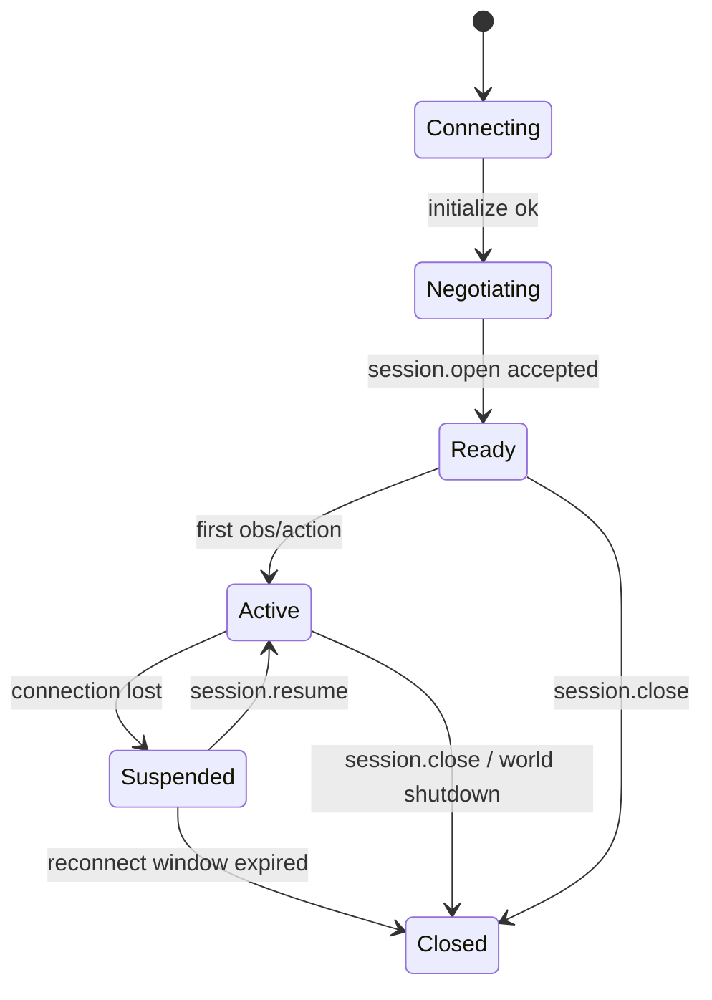

| From | Event | To | Requirement |
|---|---|---|---|
| Connecting | `initialize` succeeds | Negotiating | `[AWP-SES-001]` |
| Negotiating | `session.open` accepted | Ready | `[AWP-SES-002]` |
| Ready/Active | control connection lost | Suspended | `[AWP-SES-003]` |
| Suspended | `session.resume` with valid token within window | Active | `[AWP-SES-004]` |
| Suspended | window expires | Closed; world MUST release embodiments per safety policy | `[AWP-SES-005]` |
| any | `session.close` | Closed; running actions transition per [lifecycle](/spec/loop/action-lifecycle) | `[AWP-SES-006]` |

Worlds MUST emit a `session.state` notification on every transition. `[AWP-SES-007]`
