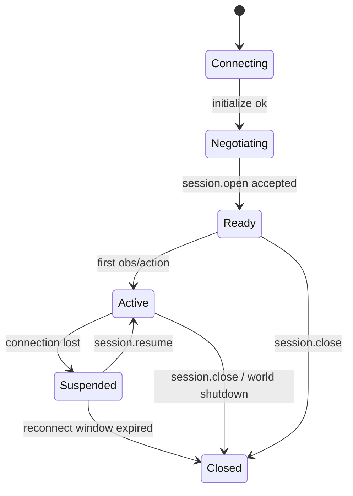

| From | Event | To | Requirement |
|---|---|---|---|
| Connecting | `initialize` succeeds | Negotiating | `[AWP-SES-001]` |
| Negotiating | `session.open` accepted | Ready | `[AWP-SES-002]` |
| Ready/Active | control connection lost (AWP-SAF-002) | Suspended; the watchdog (AWP-SAF-003) keeps running independently | `[AWP-SES-003]` |
| Suspended | `session.resume` with valid token and `last_status_seq` within window | Active; statuses replayed (AWP-CTL-008); embodiment stays in safe state until a new action executes (AWP-SAF-008) | `[AWP-SES-004]` |
| Suspended | window expires | Closed; world MUST apply safe state if not already entered, then release embodiments (AWP-EMB-002) | `[AWP-SES-005]` |
| any | `session.close` | Closed; pre-execution actions → `cancelled` (`session_closed`), `executing` actions → `cancelling` → `cancelled` (`session_closed`) after safe abort; embodiment released after safe state | `[AWP-SES-006]` |

Worlds MUST emit a `session.state` notification on every transition. `[AWP-SES-007]`

## Recovery scope

Recovery in v0.1 covers loss of the control connection while the world process is alive. If the world has restarted or otherwise no longer holds the session, `session.resume` MUST fail with `AWP_SESSION_UNKNOWN`; the agent MUST treat the session as `Closed`, re-run `initialize` and `session.open`, and MUST NOT assume any prior action or grant survives. Crash-durable sessions are out of scope for v0.1 and MUST NOT be claimed. `[AWP-SES-008]`
