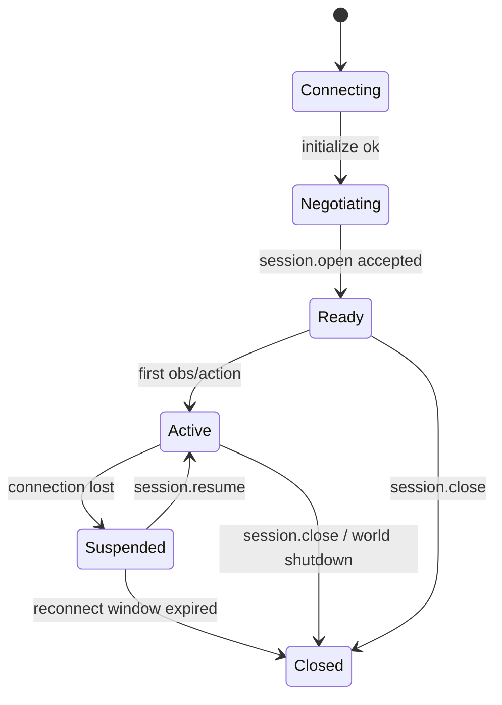

## Discovery

The world's endpoint is deployment configuration ([transport](/spec/transport/overview)). Capability discovery is `initialize`: the agent states the protocol versions it supports and what it can consume, and the world answers with its manifest — embodiments, channels, action types, capabilities, and safety policy — under the selected version (AWP-VER-002). `world.manifest` re-fetches the same document at any time. Everything the agent may later request is visible in that one response.

## State machine

| From | Event | To | Requirement |
|---|---|---|---|
| Connecting | `initialize` succeeds | Negotiating | `[AWP-SES-001]` |
| Negotiating | `session.open` accepted | Ready | `[AWP-SES-002]` |
| Ready/Active | control connection lost (AWP-SAF-002) | Suspended; the watchdog (AWP-SAF-003) keeps running independently | `[AWP-SES-003]` |
| Suspended | `session.resume` with valid token and `last_status_seq` within window | Active; statuses replayed (AWP-CTL-008); an embodiment in safe state stays there until a new action executes (AWP-SAF-008); actions still executing continue | `[AWP-SES-004]` |
| Ready/Active | `session.resume` with a valid token on a new connection before the old connection's loss is detected | The world closes the old connection, emits `session.state: suspended` (reason `connection_replaced`) and resumes as in AWP-SES-004 on the new connection. The watchdog is unaffected: it measures agent traffic, not connections | `[AWP-SES-010]` |
| Suspended | window expires | Closed; world MUST apply safe state if not already entered, then release embodiments (AWP-EMB-002) | `[AWP-SES-005]` |
| any | `session.close` | Closed; pre-execution actions → `cancelled` (`session_closed`), `executing` actions → `cancelling` → `cancelled` (`session_closed`) after safe abort; embodiment released after safe state. The session is *closing* until then (AWP-SES-011) | `[AWP-SES-006]` |

Worlds MUST emit a `session.state` notification — `{ state, status_seq, ts_mono_ns, reason? }`, [schema](/api-reference/schemas/session-state) — on every transition from `Ready` onward; it shares the `status_seq` sequence with statuses and events (AWP-CTL-008), so the `suspended` transition reaches the agent on replay after `session.resume`. `[AWP-SES-007]`

### Closing

- From `session.close` until `Closed` the session is closing. The world MUST send the `session.close` result only after every action has reached a terminal state and `session.state: closed` has been sent, so the result tells the agent its actions are over and the embodiment is at rest; agents SHOULD allow the longest declared `max_abort_ms` when awaiting it. While closing, the world MUST refuse `action.submit`, `action.cancel`, `obs.subscribe`, `obs.unsubscribe`, `world.tick`, `world.reset`, and `session.resume` of the session with `AWP_SESSION_EXPIRED`, and answer a repeated `session.close` together with the first; `ping`, `action.status`, and `world.manifest` are served as usual. In lockstep no advance follows a close, so the safe abort completes without one: the world stops the embodiment where it stands and reports the transitions before the result. `[AWP-SES-011]`

### Connections without a session

- Heartbeat obligations begin at `session.ready` (AWP-SAF-001). A world MAY close a connection that has no session after a period of agent silence of its choosing, which SHOULD be at least 15 s (three default heartbeat intervals). An agent that holds such a connection open SHOULD send `ping` meanwhile; its result is stamped on a world clock that is not a session clock and MUST NOT enter the offset estimate (AWP-CLK-008). `[AWP-SES-012]`

## Session identity

`session.ready` carries `session_id`, a world-assigned identifier stable for the life of the session and unique within the world process. It names the session in approval requests, `world_resetting` events, and audit records, and MAY be shown to other sessions; it is not a credential and grants nothing. The `session_token` is the credential and is never used as an identifier. `[AWP-SES-009]`

## Recovery scope

Recovery in v0.1 covers loss of the control connection while the world process is alive. If the world has restarted or otherwise no longer holds the session, `session.resume` MUST fail with `AWP_SESSION_UNKNOWN`; the agent MUST treat the session as `Closed`, re-run `initialize` and `session.open`, and MUST NOT assume any prior action or grant survives. Crash-durable sessions are out of scope for v0.1 and MUST NOT be claimed. `[AWP-SES-008]`
